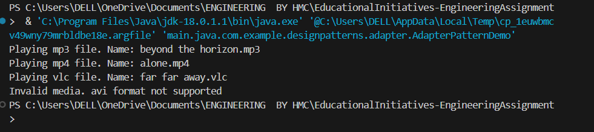
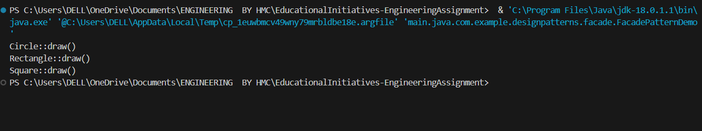
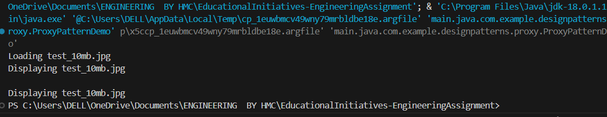
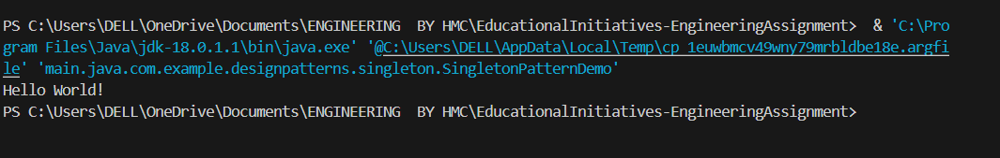
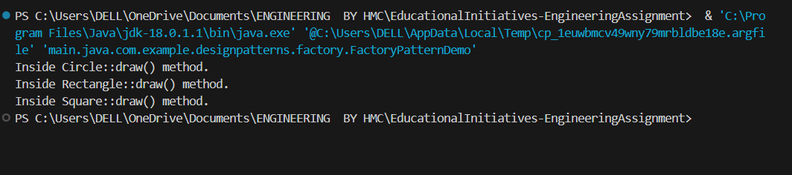
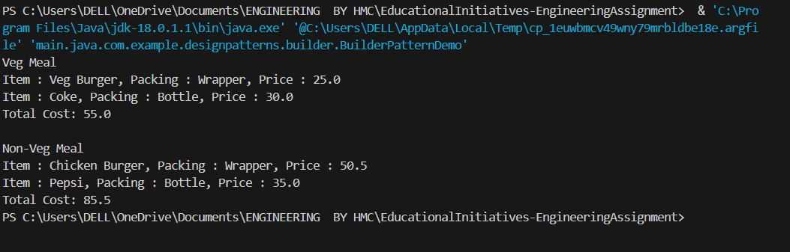
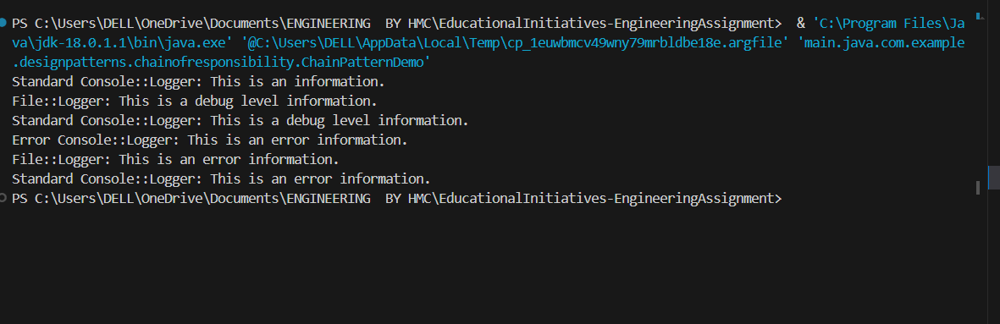
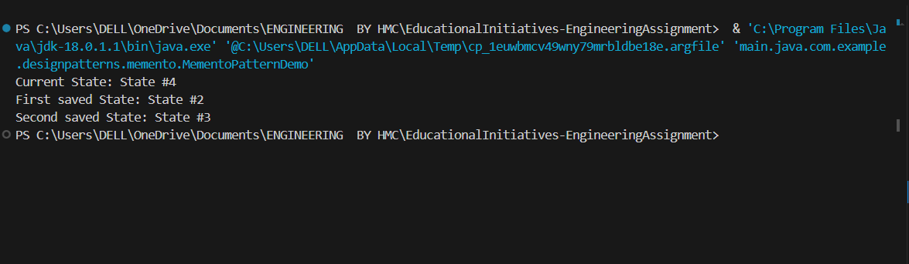
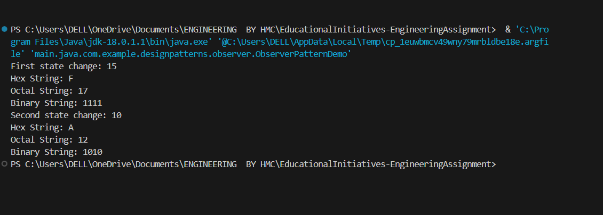

# Design Patterns

This directory contains implementations of various design patterns in Java.

## Table of Contents

- [Design Patterns](#design-patterns)
  - [Table of Contents](#table-of-contents)
  - [Folder Structure](#folder-structure)
- [Structural Patterns](#structural-patterns)
  - [Adapter Pattern](#adapter-pattern)
  - [Facade Pattern](#facade-pattern)
  - [Proxy Pattern](#proxy-pattern)
- [Creational Patterns](#creational-patterns)
  - [Singleton Pattern](#singleton-pattern)
  - [Factory Pattern](#factory-pattern)
  - [Builder Pattern](#builder-pattern)
- [Behavioral Patterns](#behavioral-patterns)
  - [Chain of Responsibility Pattern](#chain-of-responsibility-pattern)
  - [Memento Pattern](#memento-pattern)
  - [Observer Pattern](#observer-pattern)
- [Screenshots](#screenshots)
    - [Adapter Pattern](#adapter-pattern-1)
    - [Facade Pattern](#facade-pattern-1)
    - [Proxy Pattern](#proxy-pattern-1)
    - [Singleton Pattern](#singleton-pattern-1)
    - [Factory Pattern](#factory-pattern-1)
    - [Builder Pattern](#builder-pattern-1)
    - [Chain of Responsibility Pattern](#chain-of-responsibility-pattern-1)
    - [Memento Pattern](#memento-pattern-1)
    - [Observer Pattern](#observer-pattern-1)
  - [Author](#author)

## Folder Structure

```
└── 📁designpatterns
    └── 📁adapter
        └── AdapterPatternDemo.java
        └── AdvancedMediaPlayer.java
        └── AudioPlayer.java
        └── MediaAdapter.java
        └── MediaPlayer.java
        └── Mp4Player.java
        └── VlcPlayer.java
    └── 📁builder
        └── Bottle.java
        └── BuilderPatternDemo.java
        └── Burger.java
        └── ChickenBurger.java
        └── Coke.java
        └── ColdDrink.java
        └── Item.java
        └── Meal.java
        └── MealBuilder.java
        └── Packing.java
        └── Pepsi.java
        └── VegBurger.java
        └── Wrapper.java
    └── 📁chainofresponsibility
        └── AbstractLogger.java
        └── ChainPatternDemo.java
        └── ConsoleLogger.java
        └── ErrorLogger.java
        └── FileLogger.java
    └── 📁facade
        └── Circle.java
        └── FacadePatternDemo.java
        └── Rectangle.java
        └── Shape.java
        └── ShapeMaker.java
        └── Square.java
    └── 📁factory
        └── Circle.java
        └── FactoryPatternDemo.java
        └── Rectangle.java
        └── Shape.java
        └── ShapeFactory.java
        └── Square.java
    └── 📁memento
        └── CareTaker.java
        └── Memento.java
        └── MementoPatternDemo.java
        └── Originator.java
    └── 📁observer
        └── BinaryObserver.java
        └── HexaObserver.java
        └── Observer.java
        └── ObserverPatternDemo.java
        └── OctalObserver.java
        └── Subject.java
    └── 📁proxy
        └── Image.java
        └── ProxyImage.java
        └── ProxyPatternDemo.java
        └── RealImage.java
    └── 📁singleton
        └── Singleton.java
        └── SingletonPatternDemo.java
```

# Structural Patterns

## Adapter Pattern
**Files:**
- `AdvancedMediaPlayer.java`
- `AudioPlayer.java`
- `MediaAdapter.java`
- `Mp4Player.java`
- `VlcPlayer.java`
- `AdapterPatternDemo.java`

**Explanation:** Allows incompatible interfaces to work together. It acts as a bridge between two incompatible interfaces.

**Tests:** `AdapterPatternTest.java`

## Facade Pattern
**Files:**
- `Circle.java`
- `Rectangle.java`
- `Shape.java`
- `ShapeMaker.java`
- `Square.java`
- `FacadePatternDemo.java`

**Explanation:** Provides a simplified interface to a complex subsystem.

**Tests:** `FacadePatternTest.java`

## Proxy Pattern
**Files:**
- `Image.java`
- `ProxyImage.java`
- `RealImage.java`
- `ProxyPatternDemo.java`

**Explanation:** Provides a surrogate or placeholder for another object to control access to it.

**Tests:** `ProxyPatternTest.java`

# Creational Patterns

## Singleton Pattern
**Files:**
- `Singleton.java`
- `SingletonPatternDemo.java`

**Explanation:** Ensures a class has only one instance and provides a global point of access to it.

**Tests:** `SingletonTest.java`

## Factory Pattern
**Files:**
- `Shape.java`
- `Circle.java`
- `Rectangle.java`
- `Square.java`
- `ShapeFactory.java`
- `FactoryPatternDemo.java`

**Explanation:** Creates objects without exposing the instantiation logic to the client and refers to the newly created object through a common interface.

**Tests:** `FactoryPatternTest.java`

## Builder Pattern
**Files:**
- `Item.java`
- `Packing.java`
- `Wrapper.java`
- `Bottle.java`
- `Burger.java`
- `ColdDrink.java`
- `VegBurger.java`
- `ChickenBurger.java`
- `Coke.java`
- `Pepsi.java`
- `Meal.java`
- `MealBuilder.java`
- `BuilderPatternDemo.java`

**Explanation:** Constructs complex objects by separating construction and representation.

**Tests:** `BuilderPatternTest.java`

# Behavioral Patterns

## Chain of Responsibility Pattern
**Files:**
- `AbstractLogger.java`
- `ConsoleLogger.java`
- `ErrorLogger.java`
- `FileLogger.java`
- `ChainPatternDemo.java`

**Explanation:** Creates a chain of receiver objects for a request, where each receiver in the chain processes the request.

**Tests:** `ChainPatternDemo.java`

## Memento Pattern
**Files:**
- `Memento.java`
- `Originator.java`
- `CareTaker.java`
- `MementoPatternDemo.java`

**Explanation:** Captures and restores an object's internal state without exposing its internal structure.

**Tests:** `MementoPatternDemo.java`

## Observer Pattern
**Files:**
- `Observer.java`
- `Subject.java`
- `BinaryObserver.java`
- `OctalObserver.java`
- `HexaObserver.java`
- `ObserverPatternDemo.java`

**Explanation:** Defines a dependency between objects so that when one object changes state, all its dependents are notified and updated automatically.

**Tests:** `ObserverPatternDemo.java`

# Screenshots

### Adapter Pattern
  

### Facade Pattern


### Proxy Pattern


### Singleton Pattern


### Factory Pattern


### Builder Pattern


### Chain of Responsibility Pattern


### Memento Pattern


### Observer Pattern



## Author
**[Harsh Mishra](https://github.com/HARSHMISHRA-521/)**