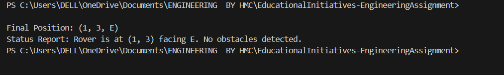
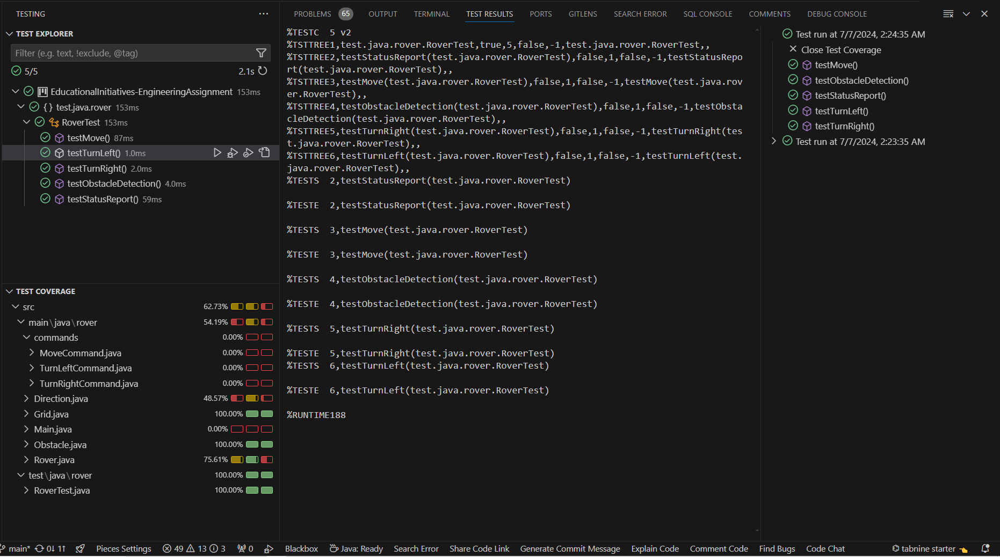

# Project Documentation
 ### Mars Rover Programming Exercise
 - Problem Statement
 
    Create a simulation for a Mars Rover that can navigate a grid-based terrain. Your  Rover should be able to move forward, turn left, and turn 
    right. You'll need to make sure that it avoids obstacles and stays within the boundaries of the grid. Remember to use pure Object-Oriented 
    Programming, design patterns, and avoid using if-else conditional constructs

## Index

1. [Introduction](#introduction)
2. [Folder Structure](#folder-structure)
3. [Design Patterns](#design-patterns)
4. [Object-Oriented Principles](#object-oriented-principles)
5. [Functional Requirements](#functional-requirements)
6. [Key Focus Areas](#key-focus-areas)
7. [Inputs and Outputs](#inputs-and-outputs)
8. [Evaluation Criteria](#evaluation-criteria)
9. [Code Walkthrough](#code-walkthrough)
10. [Test Cases](#Test-Cases)

---

## Introduction

### Overview of the Mars Rover Simulation Project
The Mars Rover Simulation project aims to simulate the movement of a rover on a grid, following specific commands while detecting obstacles.

### Purpose and Goals
To demonstrate proficiency in Java programming, design patterns (Command and Composite), and object-oriented principles (encapsulation, inheritance, polymorphism).

---

## Folder Structure

### Explanation of the project's folder organization

    ```
└── 📁MarsRover
    └── 📁src
        └── 📁main
        │   └── 📁java
        │       └── 📁rover
        │           └── 📁commands
        │               └── Command.java
        │               └── MoveCommand.java
        │               └── TurnLeftCommand.java
        │               └── TurnRightCommand.java
        │           └── Direction.java
        │           └── Grid.java
        │           └── Obstacle.java
        │           └── Rover.java
        └── 📁test
            └── 📁java
                └── 📁rover
                    └── RoverTest.java
                    └── .gitignore

    ```

    
---

## Design Patterns

### Explanation of Command Pattern and Composite Pattern usage

- **Command Pattern**: Implemented in `Command.java`, `MoveCommand.java`, `TurnLeftCommand.java`, and `TurnRightCommand.java` to encapsulate rover commands (`M`, `L`, `R`).
- **Composite Pattern**: Implicitly used in `Grid.java` to represent the grid and obstacles as a unified structure.

---

## Object-Oriented Principles

### Discussion on encapsulation, inheritance, and polymorphism

- **Encapsulation**: Data hiding and method abstraction in classes like `Rover`, `Grid`, and `Obstacle`.
- **Inheritance**: `Direction.java` uses enum constants to represent cardinal directions.
- **Polymorphism**: Commands (`Command.java`) are polymorphic in nature, allowing flexibility in execution.

---

## Functional Requirements

### Detailed description of what the project aims to achieve

- Initialize Rover with position and direction.
- Execute commands (`M`, `L`, `R`) to move and turn the Rover.
- Detect obstacles (`Obstacle.java`) and prevent Rover movement if detected.
- Provide a status report with current position and direction.

---

## Key Focus Areas

### Behavioral Pattern: Command Pattern

- Command Pattern for command encapsulation.

### Structural Pattern: Composite Pattern

- Composite Pattern in managing grid and obstacles.

### Object-Oriented Programming Principles

- Encapsulation, Inheritance, Polymorphism applied throughout the project.

---

## Inputs and Outputs

### Example inputs and expected outputs

- **Inputs**:
  - Grid Size: 10x10
  - Starting Position: (0, 0, N)
  - Commands: ['M', 'M', 'R', 'M', 'L', 'M']
  - Obstacles: [(2, 2), (3, 5)]
  
- **Expected Outputs**:
  - Final Position: (1, 3, E)
  - Status Report: "Rover is at (1, 3) facing East. No Obstacles detected."

---

- **OUTPUT GENERATED**:                 
   

## Evaluation Criteria

### Criteria for assessing code quality, functionality, and standards

- Code Quality: Adherence to best practices, SOLID principles, and design patterns.
- Functionality: Fulfillment of all specified tasks.
- Global Convention: Clear, understandable code structure and naming conventions.
- Gold Standards: Effective handling of logging, exceptions, and validations.
- Code Walkthrough: Ability to explain architecture, design patterns, and decision-making process.

---

## Code Walkthrough

### Detailed explanation of the architecture, design patterns used, and decisions made

- See the respective sections above for detailed explanations on each aspect of the project.

---

## Test Cases



## Conclusion

This documentation provides a comprehensive overview of the Mars Rover Simulation project, focusing on its design, implementation, and evaluation criteria.


## Author
### * ```HARSH MISHRA ```

